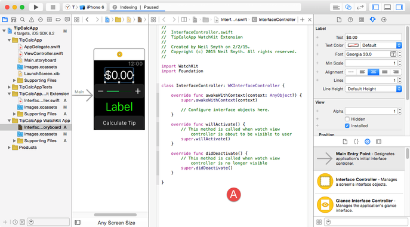

Les applications natives pour **iPhone** et **iPad** sont développées exclusivement sur un ordinateur **Mac** avec l'IDE **XCode**.



### Les langages spécifiques

Le langage utilisé au départ était **Objective C**, une extension du langage C Ansi. Il a été défini par Brad Cox au début des années 80, tout comme le C++ son concurrent. Ce langage a été choisi par la société Next pour développer son système *NextStep*.

Steve Jobs alors dirigeant de la société Next amène l'ensemble de l'ingénierie de Next lors de son retour chez Apple. Ce système permettra la renaissance d'Apple et le développement de nouveaux produits comme **OS X** et l'**iPhone**.

Le langage est conçu sur l'envoi de messages à des objets. La gestion de la mémoire reste encore sous la responsabilité du programmeur comme en C ou C++.

#### Swift

<svg version="1.1" xmlns="http://www.w3.org/2000/svg" height="64px" viewBox="0 0 100 59.3911">
	<path fill="#F05138" d="M47.0606,36.6607c-0.0014-0.0018-0.0027-0.0031-0.0042-0.0048c0.0657-0.2236,0.1335-0.4458,0.191-0.675
	c2.465-9.8209-3.5511-21.4319-13.7316-27.5454c4.4613,6.0479,6.4339,13.3733,4.6813,19.7795
	c-0.1563,0.5714-0.3442,1.1198-0.5519,1.6528c-0.2254-0.1481-0.5094-0.3162-0.8908-0.5265c0,0-10.1269-6.2527-21.1028-17.3122
	c-0.288-0.2903,5.8528,8.777,12.8219,16.1399c-3.2834-1.8427-12.4338-8.5004-18.2266-13.8023
	c0.7117,1.1869,1.5582,2.3298,2.4887,3.4301c4.8375,6.1349,11.1462,13.7044,18.7043,19.5169
	c-5.3104,3.2498-12.8141,3.5025-20.2852,0.0034c-1.8479-0.866-3.5851-1.9109-5.1932-3.0981
	c3.1625,5.0585,8.0332,9.4229,13.9613,11.9708c7.0695,3.0381,14.0996,2.8321,19.3356,0.0498l-0.0041,0.006
	c0.0239-0.0151,0.0543-0.0316,0.0791-0.0469c0.215-0.1156,0.4284-0.2333,0.6371-0.3576
	c2.5157-1.3058,7.4847-2.6306,10.1518,2.5588C50.7755,49.6699,52.1635,42.9395,47.0606,36.6607z"/>
</svg>

Pour satisfaire aux besoins d'un langage plus moderne, débarrassé des contraintes rébarbatives de gestion de la mémoire, Apple a conçu en 2014 un nouveau langage le **Swift**.

Objective C et Swift sont des langages exclusivement utilisé par Apple pour ses produits. Même si Apple pousse pour que Swift soit utilisé sur plus de plateformes, cela n'est pas encore le cas.

#### Une exemple en Objective C

```objective-c
-(void)testMethod:(BOOL(^)(NSInteger))guessTheNumber {
  BOOL winner = guessTheNumber(5);
  if( winner ) {
    NSLog(@"We won!");
  }
  else {
    NSLog(@"We lost.");
  }
}

-(void)runTest {
  [self testMethod:^(NSInterger guessTheNumber) {
    BOOL guessedRight = NO;
    if( guessTheNumber == 3) {
      guessedRight = YES;
    }
    return guessedRight;
  }];
}
```

#### Une exemple en Swift

```swift
func sayHelloWorld() -> String {
  return "hello, world"
}

println(sayHelloWorld())
```


### Distribution des applications

Les applications sont **signées numériquement** et doivent être distribués par l'**Apple Store** pour les applications disponibles à une diffusion publique.

Il est possible par le biais de l'abonnement **Apple Developer Enterprise** de diffuser des applications de manière privée au sein d'une organisation comme l'Université par exemple. Cette méthode de distribution est appelée **In-House Distribution**.

### Matériel

le matériel est limité aux produits de la marque Apple : iPhone, iPad et iPad Pro
