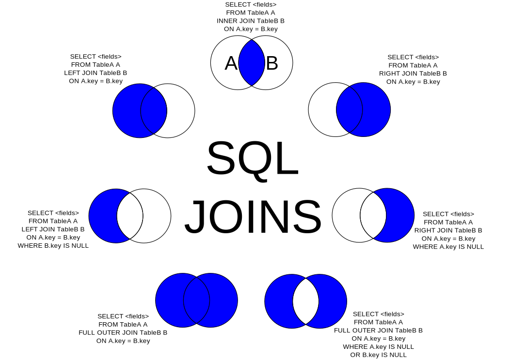

Les jointures en SQL (ou joins en anglais) permettent de combiner des enregistrements de plusieurs tables d'une base de données en fonction d'une condition définie. Elles sont utilisées lorsque l'on veut extraire des données provenant de plusieurs sources qui partagent un lien commun, souvent une clé étrangère (foreign key). 

Le type de jointure utilisé dépend du résultat attendu et de la structure des données.

## Jointure interne (INNER JOIN)

C'est le type de jointure le plus courant. Il ne renvoie que les lignes qui ont des correspondances dans les deux tables. Autrement dit, seules les lignes pour lesquelles il y a des données correspondantes dans les deux tables seront retournées.

```sql
SELECT table1.colonne, table2.colonne
FROM table1
INNER JOIN table2
ON table1.id = table2.id;
```

Dans cet exemple, seules les lignes qui ont le même id dans table1 et table2 seront incluses dans le résultat.

## Jointure externe gauche (LEFT JOIN ou LEFT OUTER JOIN)

Cette jointure renvoie **toutes** les lignes de la table de gauche, même si elles n'ont pas de correspondance dans la table de droite. Si aucune correspondance n'est trouvée, les colonnes de la table de droite contiendront des valeurs NULL.

```sql
SELECT table1.colonne, table2.colonne
FROM table1
LEFT JOIN table2
ON table1.id = table2.id;
```

Ici, toutes les lignes de table1 seront retournées, et s'il n'y a pas de correspondance dans table2, les colonnes associées à table2 seront remplies par des valeurs NULL.

## Jointure externe droite (RIGHT JOIN ou RIGHT OUTER JOIN)

C'est l'inverse du LEFT JOIN. Elle renvoie toutes les lignes de la table de droite et les lignes correspondantes de la table de gauche. Si une ligne de la table de droite n'a pas de correspondance dans la table de gauche, les colonnes de la table de gauche auront des valeurs NULL.

```sql
SELECT table1.colonne, table2.colonne
FROM table1
RIGHT JOIN table2
ON table1.id = table2.id;
```

Dans cet exemple, toutes les lignes de table2 seront incluses, même si elles ne correspondent pas à table1.

## Jointure externe complète (FULL JOIN ou FULL OUTER JOIN)

Cette jointure combine les fonctionnalités des jointures gauche et droite. Elle renvoie toutes les lignes des deux tables, avec des valeurs NULL là où il n'y a pas de correspondance dans l'autre table.

```sql
SELECT table1.colonne, table2.colonne
FROM table1
FULL JOIN table2
ON table1.id = table2.id;
```

Cela renvoie toutes les lignes de table1 et table2, qu'il y ait ou non des correspondances entre les deux.

## Jointure croisée (CROSS JOIN)

La jointure croisée renvoie le produit cartésien des deux tables. Chaque ligne de la première table est combinée avec chaque ligne de la deuxième table. Cela produit un grand nombre de lignes dans le résultat.

```sql
SELECT table1.colonne, table2.colonne
FROM table1
CROSS JOIN table2;
```

Cela peut être utile dans des situations spécifiques mais doit être utilisé avec prudence car cela peut générer des résultats volumineux.

## Self Join (auto-jointure)

C'est une jointure dans laquelle une table est jointe avec elle-même. Cela peut être utile pour comparer les lignes d'une même table.

```sql
SELECT A.colonne, B.colonne
FROM table A, table B
WHERE A.id = B.id;
```

