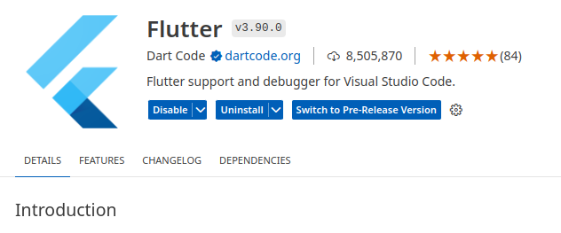

> ***Objectif :*** Mettre en place un environnement de développement pour Flutter
{: .objectif}


### Android Studio

Installer Android Studio

Dans Andoid Studio assurez vous d'avoir au moins un SDK installé ainsi que le composant ***Android SDK Command-line Tools***

#### Emulateur Android

Ajouter un appareil virtuel dans le menu Device Manager

### Plugin Flutter

Installer le plugin [Flutter](https://marketplace.visualstudio.com/items?itemName=Dart-Code.flutter) dans Visual Studio Code.

Placer Flutter à la racine de votre dique C



Vérifier que le plugin [Dart](https://marketplace.visualstudio.com/items?itemName=Dart-Code.dart-code) a bien été installé conjointement.

Avec Visual Studio Code lancer l'outil de diagnostic **flutter doctor** à partir du menu View, Command
Palette (Ctrl Maj P)

Mettre à jour le path dans les Variables d'environnement de l'utilisateur, pour pointer vers le dossier C:\Flutter\bin


Vérifier que les appareils sont disponibles

```
[✓] Connected device (3 available)
    • sdk gphone64 x86 64 (mobile) • emulator-5554 • android-x64    • Android 14 (API 34) (emulator)
    • Linux (desktop)              • linux         • linux-x64      • Debian GNU/Linux 12 (bookworm) 6.1.0-21-amd64
    • Chrome (web)                 • chrome        • web-javascript • Chromium 125.0.6422.141 built on Debian 12.5, running on Debian 12.5
```

### Projet

Créer un nouveau projet Flutter - Menu palette Flutter: New Project

Choisir Empty Application, puis le dossier, puis le nom de l'application (cinema_flutter)

Lancer l'emulateur depuis Visual Studio Code - Menu palette Flutter: Launch Emulator

Vous pouvez aussi relier votre téléphone avec un cable USB.

### Debugger

create a launch.json file

```json
{
  "version": "0.2.0",
  "configurations": [
    {
      "name": "Emulateur Android",
      "request": "launch",
      "type": "dart",
      "args": ["-d", "emulator-5554"]
    },
    {
      "name": "Chrome",
      "request": "launch",
      "type": "dart",
      "args": ["-d", "chrome"]
    },
  ]
}
```
