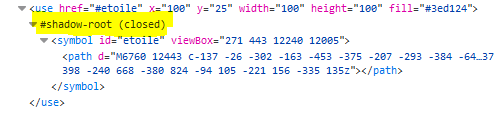

## Réutilisation des éléments

Chaque objet référencé avec un identifiant `id` peut être dupliquer et réutiliser n'importe où dans le document à l'aide de la balise `<use>`.

<svg>
  <circle id="cercle" fill="#3ed124" cx="50" cy="50" r="25" />
  <use href="#cercle" x="75" y="0">
</svg>

```svg
<svg>
  <circle id="cercle" fill="#3ed124" cx="50" cy="50" r="25" />
  ...
  <use href="#cercle" x="75" y="0">
</svg>
```

Cete méthode n'est pas une bonne pratique car le code est difficilement lisibile et maintenable.

## Bibliothèque d'éléments

À la place, nous pouvons stoker les éléments réutilisables dans une bibliothèque avec la balise `<defs>`. Les éléments ne sont alors plus affichés directement.

Lorsque l'on utilise le SVG en mode inline incorporé directement dans la page HTML, les éléments de la bibliothèque peuvent être utilisés dans le canvas ou dans un autre élément SVG de la même page.

```svg
<!-- Cette illustration SVG ne sera pas visible dans la page -->
<svg width="0" height="0">
<defs>
  <line id="ligneverte" stroke="#3ed124" x1="-50" y1="0" x2="50" y2="0"
    stroke-linecap="round" stroke-width="12" />
</defs>
</svg>
...
<!-- Une autre illustration plus loin dans la page HTML -->
<svg>
  <use href="#ligneverte" x="100" y="50"/>
</svg>
```

<svg width="0" height="0">
<defs>
  <pattern id="tenthGrid" width="25" height="25" patternUnits="userSpaceOnUse">
    <path d="M 25 0 L 0 0 0 25" fill="none" stroke="gray" stroke-width="0.5"/>
  </pattern>
  <pattern id="fiftygrid" width="50" height="50" patternUnits="userSpaceOnUse">
    <rect width="50" height="50" fill="url(#tenthGrid)"/>
    <path d="M 50 0 L 0 0 0 50" fill="none" stroke="gray" stroke-width="1"/>
  </pattern>
  <symbol id="grid">
    <rect width="100%" height="100%" fill="url(#fiftygrid)"/>
    <path d="M 500 0 L 500 250 0 250" fill="none" stroke="gray" stroke-width="1"/>
  </symbol>
  <line id="ligneverte" stroke="#3ed124" x1="-50" y1="0" x2="50" y2="0"
    stroke-linecap="round" stroke-width="12" />
</defs>
</svg>

<svg>
  <use href="#grid"/>
  <use href="#ligneverte" x="100" y="50"/>
</svg>

La bibliothèque permet des stocker des formes mais aussi des dégradés, des motifs, des masques, des marqueurs etc. 

### Symboles

L'élément `symbol` permet de définir une nouvelle zone de dessin indépendante et qui sera utilisée comme modèle (template).

<svg>
<defs>
<symbol id="etoile" viewBox="271 443 12240 12005">
  <path d="M6760 12443 c-137 -26 -302 -163 -453 -375 -207 -293 -384 -645 -802
    -1598 -347 -790 -486 -1070 -667 -1337 -211 -311 -357 -373 -878 -374 -303 0
    -573 22 -1315 106 -310 36 -666 73 -930 97 -191 17 -792 17 -905 0 -359 -56
    -525 -174 -538 -382 -7 -128 43 -265 161 -442 197 -294 514 -612 1317 -1323
    955 -845 1247 -1174 1290 -1452 37 -234 -95 -656 -453 -1458 -364 -816 -430
    -963 -490 -1110 -252 -611 -352 -998 -318 -1236 31 -222 145 -333 357 -346
    311 -21 768 169 1699 704 749 431 885 508 1051 596 451 240 718 338 924 341
    121 1 161 -10 310 -84 265 -133 574 -380 1300 -1040 1006 -916 1405 -1206
    1752 -1276 102 -21 173 -13 255 27 103 50 160 135 204 304 21 81 23 111 23
    315 0 125 -5 267 -12 320 -51 379 -107 674 -253 1335 -229 1034 -279 1327
    -279 1647 0 162 16 260 55 346 101 221 462 490 1275 952 661 375 831 473 1005
    578 739 446 1065 761 1065 1027 0 155 -96 273 -306 378 -300 150 -748 236
    -1764 342 -1052 108 -1334 148 -1637 225 -387 100 -514 201 -648 515 -117 276
    -211 629 -391 1482 -135 644 -212 973 -289 1237 -115 398 -240 668 -380 824
    -94 105 -221 156 -335 135z"/>
</symbol>
</defs>
<use href="#grid"/>
<use href="#etoile" x="100" y="25" width="100" height="100" fill="#3ed124"/>
</defs>
</svg>


```svg
<svg>
<defs>
<symbol id="etoile" viewBox="271 443 12240 12005">
  <path d="M6760 12443 c-137 -2 ..." />
</symbol>
</defs>
.
<use href="#etoile" x="100" y="25" width="100" height="100" fill="#3ed124"/>
```

L'intérêt du symbole est que l'on peut définir la [surface de travail](../zone) à l'aide de la propriété viewBox. Dans notre cas la zone commence à 271 px à gauche, 443 px en haut et fait 12240 px de largeur et 12005 px de hauteur !

Lors de son utilisation dans l'illustration SVG la taille du symbole est mise à l'échelle pour ne faire plus que 100 px, sa position est définie à l'aide des propriété x et y, la couleur de remplissage est de la balise use est propagée au symbole.

Attention un symbole appelé avec la balise `<use>` est affiché dans une zone shadow dom inaccessible au javascript et aux changements de style css.

Les seules propriétés qui peuvent traverser après la création du shadow dom sont : les propriétés fill, stroke et color.

la propriété css color doit être utilisée en svg avec la valeur `currentColor` par exemple `fill="currentColor"` la propriété color peut être utilisée soit pour le remplissage, soit pour le contour à condition d'utiliser la valeur currentColor



### Références

- https://la-cascade.io/utiliser-svg-use/
- https://caniuse.com/mdn-svg_elements_symbol
