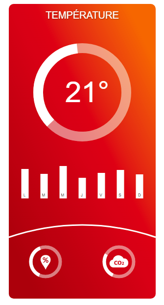

> Concevoir une interface pour une centrale de mesure d'ambiance.
{.objectif}

### Ressources

- <a href="chemical.svg" download>polluants chimiques</a>
- <a href="co2.svg" download>co2</a>
- <a href="dust.svg" download>poussière et allergènes uv</a>
- <a href="humidity.svg" download>taux d'humidité</a>
- <a href="sound.svg" download>niveau sonore</a>
- <a href="temperature.svg" download>temperature</a>
- <a href="uv.svg" download>exposition uv</a>

### Énoncé

1. Le panneau de contrôle est un **rectangle** de 300px de large est de 600px de haut. Les coins du panneau sont arrondis suivant un rayon de 10px.

2. Le remplissage du panneau est effectué par un **dégradé** qui commence à 10% en couleur hsl 25 / 100% / 50% ; à 50% la couleur est hsl 0 / 95% / 45% ; à 90% la couleur hsl est 0 / 100% / 35%

La direction du dégradé est en diagonal du coin en haut à droite au coin en bas à gauche 

3. Un **titre** centré au milieu du panneau écrit en majuscule à 30px du haut. La police est de l'Arial de taille 20px. Le texte est écit en blanc. Un filtre ombre portée est ajoutée au texte. Les paramètres de l'ombre portée sont un déplacement en x et en y de 1px, l'opacité est de 30% et la déviation standard de 1px.

4. Une **ligne arrondie** en bas du panneau part de x 0 / y 470 et rejoint l'autre côté en  x 300 / y 470 le point d'inflexion de la courbe quadratique est situé au milieu du panneau et 50px plus haut que les côtés. L'épaisseur du contour est de 3px, la couleur est blanche.

5. Ajouter **2 icones** (humidité et co2)  dans une bibliothèque de définition

6. Ajouter un **cercle** centré en dans le panneau et situé à 180px du haut.  Le cercle a un rayon de 90px et une épaisseur de 20px. La couleur de remplissage est blanc aavec une opacité de 50%

Un deuxieme **cercle partiel** recouvre le premier cercle sont opacité est de 100%. L' origine est situé à -135°, la longeur de l'arc est de 150°

Pour vous aider voici un tutoriel qui offre une solution approchante [https://css-tricks.com/building-progress-ring-quickly/](https://css-tricks.com/building-progress-ring-quickly/)

7. Ajouter un **texte** dans le cerle de taille 60px

8. Ajouter **deux petits cercle** en bas de page de rayon 30px, l'épaisseur du contour est de 7px l'opacité de 50% ajouter un **symbole** de la bibliotèque à l'intérieur des cercles. La taille du symbole est de 30px / 30px. Les cercles sont situés à 75px du bas du panneau

9. Ajouter un **graphique** en barre pour chaque jour de la semaien (7 barres). Les barres sont aligné à 390 px du haut du panneau. Les barres ont une largeur de 15px elles sont espacées de 24 px et la première commence à 25.5px du bord gauche. Les hauteurs sont variables comprise en 35px et 60px;

10. Ajouter dans chaque barre **l'initiale du jour** de la semaine (L M M J V S D) centré au milieu de la barre. La taille du texte est de 8px.
