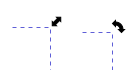
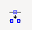
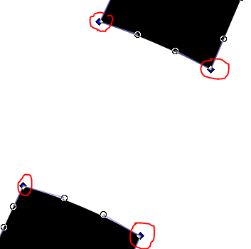
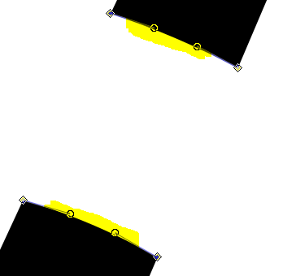
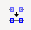
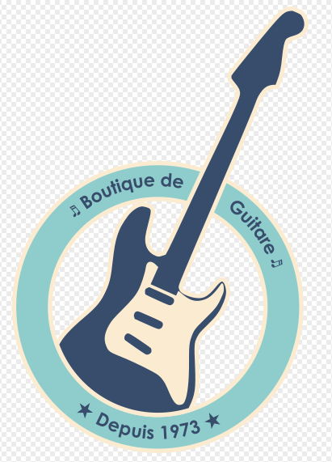

On vous demande de créer un logo à partir d'une image. Ce logo devra pouvoir être décliné suivant plusieurs schémas de couleurs. Vous décidez de le faire en SVG.

## Le logo

### Le cartouche

Le cartouche est un anneau contenant du texte.

### Dessiner l'anneau. 

Maintenir la touche `ctrl` pour un cercle parfait sinon vous aurez une ellipse.\
Fixer le rayon à 100 px.\
Ne pas remplir le cercle (cliquer sur la croix rouge dans la palette de couleur tout en bas) et fixer le contour en noir (Shift + clic sur la couleur noire).\
Régler l'épaisseur du contour à 1px (Menu Object – Fill and Stroke – Stroke Style)


Dupliquer le cercle en place (Ctrl + C ; Ctrl + Alt + V).\
Cliquer sur l'outil cercle pour retrouver les propriété et fixer le rayon à 75 px. 

Sinon Pour accéder à toutes propriétés xml des l'objets : Menu Edit – XML Editor ou Shift + Ctrl + X.

### Guide du texte

Dupliquer encore une fois le cercle en place (Ctrl + C ; Ctrl + Alt + V)\
Fixer le rayon à 87.5 px.

Afficher la liste des objets (Menu Object – Objects …) Cacher le cercle de rayon 87.5 (cliquer sur l'œil)

Sélectionner les 2 cercles restants à l'écran (100 et 75 px).\
Faire une exclusion : L'objet au premier plan est soustrait à l'autre. 

Nous avons maintenant un anneau.

Remplir l'anneau de noir et supprimer le contour. (Menu Object - Fill and Stroke)

### Texte

Cacher l'anneau que vous venez de construire. 

Afficher maintenant le cercle de rayon 87.5 px. Dupliquer le (copier-coller en place Crtl + C ; Ctrl + Alt + V)

Écrire 2 textes à n'importe quel endroit de la page par exemple :\
♬ Boutique de Guitare ♬\
★ Depuis 1973 ★

Police Century Gothic - Bold – taille 36 pt – Texte aligné au centre

Sélectionner un texte et un cercle (Shift + Clic après la première sélection).\
Positionner le texte sur le chemin (Menu Text – Put on Path)\
Cacher le chemin et le texte.

Sur le 2e cercle de 87.5px. Inverser son sens (Menu Path – Object to Path et Menu Path – Reverse). Rien n'est visible mais cela va permettre au texte d'être écrit dans l'autre sens.

Sélectionner le 2e texte avec le 2e cercle et positionner le texte sur le chemin (Menu Text – Put on Path)

Déplacer les textes le long de la circonférence du texte. Pour cela il faut effectuer une rotation du cercle support du texte.\
Cliquer sur le cercle, les contours affiche les poignées de modification de la taille.\
Cliquer une deuxième fois pour faire apparaitre les **poignées de rotation**. 




Éditer le texte, placer le curseur en tout début de la phrase (avec les flèches) et appuyer sur Alt flèche du haut ou Alt Flèche du bas pour positionner le texte verticalement et le centrer sur le cercle support.

## La guitare

Nous avons pour continuer notre logo, un modèle au format png. Importer le fichier [png](guitare.png) dans l'illustration. File – Import (Type d'importation Link)

Transformer l'image au format bitmap en objet vectoriel (Menu Path – Trace Bitmap) Laisser les options par défaut Cliquer sur update puis sur Apply si le résultat est satisfaisant.

Vous pouvez supprimer l'image depuis la liste des objets

Redimensionner la guitare en appuyant sur Ctrl pour conserver les proportions.

Cliquer une deuxième fois pour activer les poignées de rotation. Effectuer une légère rotation de la guitare.

N'oubliez de nommer les objets dans le panneau des objets

Dupliquer l'anneau. Sélectionner la copie et la guitare faire une soustraction
Attention à l'ordre des objets (l'anneau doit être avant la guitare). Utiliser les flêche du panneau Objets pour déplacer les objets vers le haut ou vers le bas.\
Menu Path – Difference

La guitare est découpée suivant l'anneau mais nous voulons que le manche soit complet

### Recoller le manche

Sélectionner les 4 points des 2 extrémités du manche.\
Couper le path  à ces 4 points. Les chemins sont coupés en 2 segments et sont toujours présents. 



Supprimer les segments des extrémités 



Sélectionner 2 points de chaque partie et joindre les points avec un segment . Faire cela pour les 2 côtés.

Décomposer la guitare en éléments constitutifs Menu Path Break Apart

Réorganiser les objets car certains sont invisible. Remplir de couleur certaines parties pour qu'elles apparaissent



Couleurs utilisées :
Anneau : remplissage #8fcdcc ;  contour 3px #fbebd1\
Guitare : remplissage #384d6c ;  contour 3px #fbebd1\
Plaque de protection : remplissage #fbebd1\
Texte : remplissage #384d6c

## utilisation dans une page

Modifier les propriété du document pour que la page englobe bien le logo.\
File - Document Properties

Sauvegarder le fichier au format SVG

Créer une page html

Ajouter le code du logo dans une définition de symbole. N'ajouter que la partie utile du svg.
Pour le viewBox du symbole vous devez reprendre le viewBox du document.
Le SVG contenant la définition n'a pas à être visible. Régler sa taille à 0

```svg
<svg width="0" height="0">
  <defs>
    <symbol id="logo" viewBox=0 0 212 318">
      <path d="M 104.1688
    ...
    </symbol>
  </defs>
</svg>
```
Ajouter un deuxième bloc SVG celui-ci servira à l'affichage de notre logo

```svg
<svg width="750" height="800">
  <use href="#logo" width="250" height="500" x="0"/>
  <use href="#logo" width="250" height="500" x="250"/>
  <use href="#logo" width="250" height="500" x="500"/>
</svg>
```

Retirer un style de remplissage de tous les éléments du symbole et ajouter le directement sur la balise use

```svg
<path style="fill:#384d6c;stroke-width:0.37352">
<path style="stroke-width:0.37352">
```

```svg
<use href="#logo" fill="#384d6c" />
```

Procéder de la même manière pour la propriété stroke

```svg
<path style="stroke:#fbebd1;stroke-width:0.37352">
<path style="stroke-width:0.37352">
```

```svg
<use href="#logo" fill="#384d6c" stroke="#fbebd1" />
```

### Comment faire pour remplacer la 3e couleur ?

Il existe une astuce qui fonctionne uniquement pour cette 3e couleur. Nous allons utiliser la propriété color qui sert pour l'html et le css mais qui n'est pas présente dans les spécification du svg

Prendre la dernière couleur et remplacer la proprété par `currentColor`

```svg
<path style="fill:#8fcdcc;stroke-width:0.37352">
<path style="fill:currentColor;stroke-width:0.37352">
```

Ajouter maintenant la propriété `color` sur la balise `use`

```svg
<use href="#logo" fill="#384d6c" stroke="#fbebd1" color="#8fcdcc" />
```

Utlisez un générateur de [palette](https://coolors.co/) pour colorier votre logo


