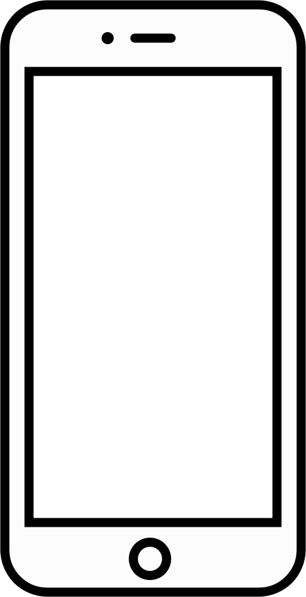

> ***Prérequis :*** le format SVG, les [formes](../) et les [propriétés](../../propriétés)
{.info}

Vous devez dessiner un téléphone au format SVG.
Utilisez Visual Studio Code avec l'extension SVG de Jock pour prévisualiser le résultat.

1. Créer un rectangle de largeur 490 et de hauteur 970. Le rectangle a des coins arrondis de 70. Le contour noir fait 15 d'épaisseur. Remplissez le rectangle d'un gris très clair (#fcfcfc).

2. Créer un deuxième rectangle de le largeur 410 et de hauteur 745. Le contour noir fait 15 d'épaisseur. Remplissez le rectangle de blanc. Le rectangle est centré horizontalement dans le premier et décalé de 110 vers le bas.

3. Dessiner une ligne de longueur 60. Le contour noir fait 15 d'épaisseur. La ligne est terminée par des arrondis. La ligne  est centré horizontalement dans le premier et centré verticalement entre les 2 rectangles.

4. Dessinez un cercle de rayon 10 alignée sur la ligne et placé à 170 du bord gauche.

5. Dessinez un cercle rempli de couleur noire de rayon 35 situé à 905 du haut.

6. Dessinez un cercle rempli de couleur blanche de rayon blanc, centré sur le premier cercle.

Télécharger la [solution](telephone.svg)
