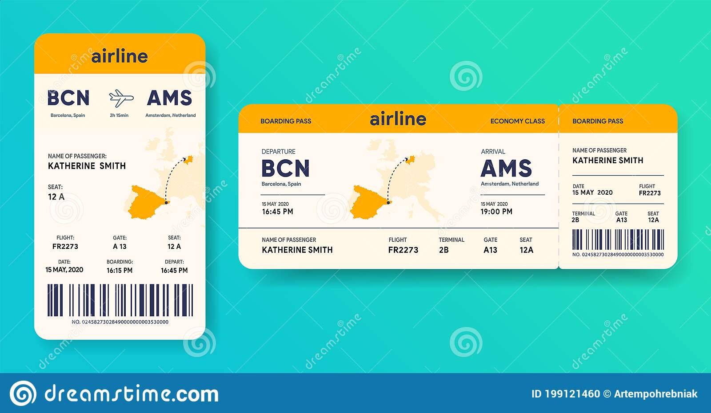

---

title: Carte
---

Créer un pdf avec jspdf

https://github.com/parallax/jsPDF

## SVG

Intégrer un fichier SVG dans le PDF

<a href="europe.svg" download>carte de l'Europe<a>

<a href="avion.svg" downlaod>avion</a>

## Code barre

https://lindell.me/JsBarcode/

## QRCode

Intégrer un QRCode dans le pdf

Librairie de base\
http://davidshimjs.github.io/qrcodejs/

Version SVG\
https://papnkukn.github.io/qrcode-svg/
