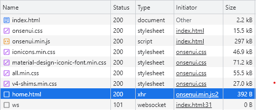

Onsenu UI est ce que appelle une [SPA](../progressive-web-app/single-page-application) (Single Page Application). Tout ce passe dans **une seule page html**. La navigation se fait en javascript en chargeant dynamiquement des **fragments** de page qui remplace le contenu actuel.

>On appelle à partir de maintenant *page* les pages d'application à ne pas confondre avec la *page* html qui sert de support à l'application SPA.
{: .warning}

### Définir les pages

Les pages d'application peuvent être définies à 2 endroits :
- dans des fichiers .html. Dans ce cas ce sont des fichier html **incomplets** car rappelez vous les pages d'application ne sont pas des pages html.
- dans le fichier .html principal en tant que **template**.


#### Fichier .html

Fichier *home.html*, fragment de page .html, contient une page d'application *ons-page*. L'élément ons-page doit être le seul élément racine du fichier.

```html
<ons-page id="home">
  Bienvenue
<ons-page>
```

#### Template

Un *template* html est un fragment de code html totalement invisible. Il est possible d'y accéder avec du code javascript, le cloner et l'ajouter dans la page en cours.

```html
<template id="home.html">
  <ons-page id="home">
    Bienvenue
  <ons-page>
</template>
```

Lors de la navigation vers la page home.html, OnsenUI regarde d'abord si un template avec l'identifiant home.html existe dans la page courante. Si c'est la cas clone le contenu du template et remplace le contenu actuel par celui-ci. Si aucun template n'est trouve OnsenUI charge par la méthode AJAX le fichier *home.html* et remplace le contenu de la page actuel par celui cloné.

En aucun cas il y a une navigation classique vers le fichier home.html mais une **substitution** du contenu de la page par un contenu **chargé par programmation**.

Du fait des 2 méthodes de chargement (fichier par ajax ou template), il est conseillé de nommer les template comme des noms de fichiers .html. D'où l'identifiant *home.html*



Notez le chargement xhr de la page *home.html*
