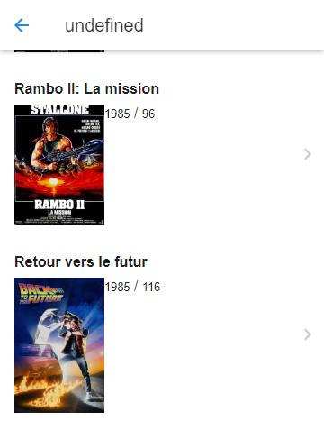

## Films

Lorsque l'on clique sur une personne passer à la deuxième page pour afficher la liste des films de cette personne en particulier.



```javascript
async function getFilms(uuid)
  {
    const data = await fetch(`http://127.0.0.1:8002/records/Personne/${uuid}?join=Equipe%2CFilm`);
    const personne = await data.json();

    const liste = document.querySelector("#page2 ons-list");

    for (let equipe of personne.Equipe)
    {
      const modele = document.querySelector("#ligne_film");
      const fragment = modele.content.cloneNode(true).firstElementChild;

      fragment.querySelector(".titre")
        .appendChild(document.createTextNode(equipe.film.titre));

      fragment.querySelector(".annee")
        .appendChild(document.createTextNode(equipe.film.annee));

      loadImage(`films/${equipe.film.id}.jpg`, fragment.querySelector("img"));

      fragment.addEventListener("click", function(evt) {
        myNavigator.pushPage('film.html', {
          data: {
            title: `${equipe.film.titre}`,
            id: evt.currentTarget.dataset.uuid
          } });
        });

      fragment.dataset.uuid = equipe.film.id;
      liste.appendChild(fragment);

    }
  }
```
