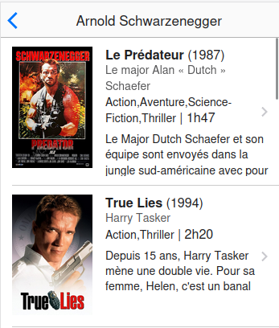

## Liste des films

Lorsque l'on clique sur une personne naviguer vers une nouvelle page qui affiche la liste des films de cette actrice ou acteur en particulier.



Afficher 

- le titre et l'année de sortie, 
- l'affiche du film (largeur de 100 pixels)
- le role joué
- les genres, la durée
- le résumé


### Web API

https://morseweiswlpykaugwtd.supabase.co/functions/v1/detail

Appel en mode POST avec les paramètres suivants

{ "personne_id": 1 }

## Détail d'un film

Afficher les détail d'un film


Colorier les étoiles en fonction de la note du film

Etoile

```
<path d="m50,2 12,34h36l-28,22 10,34-30-20-30,20 10-34-28-22h36z" />
```
