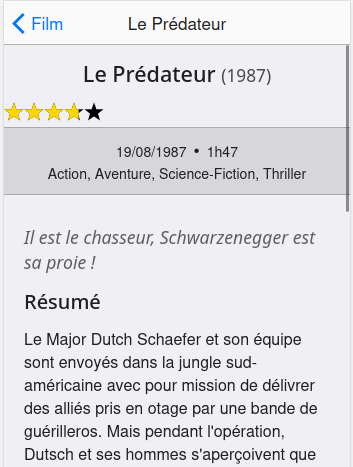
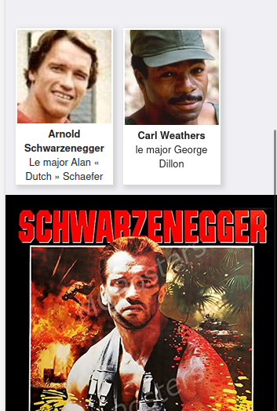

### Etape 1 : Détail d'un film

Lorsque l'on clique sur une ligne d'un film afficher les détails de ce film.

#### API

URL de la définition de l'API :
https://morseweiswlpykaugwtd.supabase.co/rest/v1/?apikey=


#### Affiche

https://morseweiswlpykaugwtd.supabase.co/storage/v1/object/public/films/film_id.jpg






### Etape 2 : Notation

Ajouter 5 étoiles et les colorier les étoiles en fonction de la note du film

Etoile

```
<path d="m50,2 12,34h36l-28,22 10,34-30-20-30,20 10-34-28-22h36z" />
```

Attention : il faut pouvoir colorier des fractions d'étoiles

Indications : Utiliser le masquage SVG et les variables CSS
