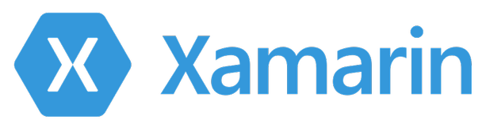

> **Objectif :** Obtenir des performances natives en utilisant un langage différent du système mais commun à plusieurs
plateformes permettant d'écrire le programme une seule fois
{: .objectif}

La compilation cross plateforme utilise un langage autre que celui préconisé par défaut par le constructeur de
l'appareil. Cela permet d'utiliser un langage déjà connu d'un développeur et de l'utiliser sur plusieurs plateformes.
Cette approche est appelée WORA Write once, run anywhere

Les performances sont proches d'une application native, cependant des librairies d'adaptation et/ou ou micro machines
virtuelles sont nécessaires à l'exécution du programme, elles ralentissent le programme de manière imperceptible mais
surtout augmentent grandement la taille de l'exécutable.

Les solutions sont :

### Xamarin

Xamarin est le fruit du portage de la plateforme .Net sur la plateforme Linux. Ce portage open source appelé Mono n'était pas conduit par Microsoft et violait sa propriété industrielle. Cependant Microsoft considéra que cette diffusion lui était profitable et s'engagea à ne pas poursuivre les auteurs ni demander de royalties. En 2016 Microsoft l'achète et l'intègre dans sa suite Visual Studio et en fait son outil officiel. Toujours en 2016 Microsoft opère un virage open source et lance .Net Core un réécriture complète et multi-plateforme de .Net. Xamarin est abandonné en 2022, mais son successeur est là.

### .Net MAUI (ex Xamarin)

.Net Multi-platform App UI est un framework de développement mobile multiplateforme utilisant le langage C# et le framework .NET core.
Il ea étét fondé en 2011 (à la base appelé « Mono for Android » et « MonoTouch » pour iOS) et fût racheté en 2016 par Microsoft. Bien qu’il soit une alternative forte au développement d’applications natives, il reste tout de même nécessaire d’écrire des parties de code spécifiques à chaque plateforme. Aujourd’hui, les applications natives sont plutôt développées en Kotlin et Swift profitant des dernières optimisations alors que Xamarin base sa partie native sur les langages Java et Objective-C. (Paragraphe à revoir)

L'interface responsive en XML utilise XAML

https://learn.microsoft.com/fr-fr/dotnet/maui/what-is-maui?view=net-maui-7.0

[https://dotnet.microsoft.com/en-us/](https://dotnet.microsoft.com/en-us/)

### React Native

React Native est un framework d'applications mobiles créé par Facebook sur la base de son framework existant React. Il est utilisé pour développer des applications natives pour Android, iOS et UWP en utilisant le langage Javascript et donc la librairie React..

> La plus grande erreur que nous ayons commise en tant que société a été de parier trop sur HTML par opposition au natif. - Mark Zuckerberg, 2012 -

[https://reactnative.dev/](https://reactnative.dev/)

React Native est une solution multiplateforme lancée par Facebook en 2015, utilisant le Javascript et ayant vite fait ses preuves au sein de la communauté des développeurs. Aujourd’hui, son principal avantage face à Flutter est son ancienneté (facilité pour le développeur de trouver des bibliothèques ou du support). Néanmoins, Flutter rattrape bien son retard grâce à sa possibilité de personnaliser les éléments d’interface, et ses performances supérieures à son concurrent direct.

React Native combine les meilleures parties du développement natif avec React, une bibliothèque JavaScript de premier ordre pour la création d'interfaces utilisateur.

Utilisez-en un peu ou beaucoup. Vous pouvez utiliser React Native aujourd'hui dans vos projets Android et iOS existants ou vous pouvez créer une toute nouvelle application à partir de zéro.

Beaucoup de liberté est laissé à au développeur, le rendu est donc fortement dépendant son niveau. React Native de part sa complexité est déconseillé aux débutants.

[https://reactnative.dev/](https://reactnative.dev/)

### Flutter

Flutter est un SDK (Kit de Développement Logiciel) open-source créé par Google. Il est utilisé pour développer des applications multiplateformes pour Android, iOS, Linux, Mac, Windows et le web à partir d'une seule base de code. Le langage utilisé est le **Dart** qui peut être compilé en langage natif ou en Javascript.

Flutter est plus accessible pour les développeurs et propose un tronc commun pour toute l’application, ce qui apporte un gain de temps substantiel.

[Flutter](flutter)

### KMP Kotlin Multiplatform Mobile

https://www.jetbrains.com/kotlin-multiplatform/
https://lp.jetbrains.com/kmm-for-crossplatform-developers/

### Native Script

NativeScript est un framework open-source qui permet de développer des applications mobiles natives pour Android et iOS en utilisant des langages web comme JavaScript, TypeScript et CSS. Il permet aux développeurs de créer des applications qui ont l'apparence et les performances d'applications natives, tout en partageant une grande partie du code entre les plateformes. Avec NativeScript, vous pouvez créer des applications riches en fonctionnalités, en utilisant les compétences que vous avez déjà en développement web.
