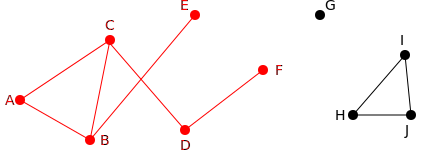

> La théorie des graphes est l'étude des structures mathématiques utilisées pour modéliser des relations par paires entre des objets. Un graphe est constitué de sommets qui sont reliés par des arêtes.
{:.definition}

Un graphe **G** est constitué de deux ensembles **V** et **E** où  
- V est un ensemble fini mais non vide de sommets ;
- E est un ensemble d’arêtes.

Une arête est un ensemble de deux sommets appartenant à V.

### Vocabulaire

Les **sommets** sont appelés aussi des **nœuds**. En anglais ils sont appelés _**nodes**_ _**points**_ ou _**vertices**_ (sing. _vertex_).

Les **arêtes** sont appelés aussi des **arcs**. En anglais ils sont appelés _**links**_, _**lines**_ ou _**edges**_.


```
V = [A, B, C, D, E, F, G, H, I, J]  
E = [{A, B}, {A, C}, {B, C}, {C, D}, {B, E}, {D, F}, {H, I}, {H, J}, {I, J}]
```

#### Notation : 

L’arête {A, B} pourra être notée  A—B ou B—A. 

### Définitions : 

Soit un graphe G = {V , E}.

- L'**ordre** (_order_) d'un graphe est le nombre de sommets \|V\| ;
- La **taille** (_size_) d'un graphe est le nombre d'arêtes \|E\| ;
- deux sommets A, B ∈ V (qui appartiennent à l'ensemble des sommets V) sont **adjacents** s’ils sont reliés par une arête. Par exemple si A—B ∈ E (l'arête A-B appartient à l'ensemble E des arêtes) ;
- une arête A—B est **incidente** aux sommets A et B ;
- le **degré** (_degree_ or _valency_) d’un sommet est le nombre d’arêtes qui lui sont incidentes.
- le **degré** d'un graphe est le maximum des degrés de ses sommets.

Dans notre exemple :
- A et B sont adjacents ;
- l’arête B—C est incidente à B et à C ;
- le degré de A est 2 ;
- le degré de B est 3 ;
- le degré de G est 0 ;
- le degré de E est 1 ;
- L'ordre du graphe est 10.

> La somme des degrés de tous les sommets d'un graphe est égal au double du nombre total d'arêtes.
{: .definition }

### Sous-graphes

Soit un graphe G = {V , E}. 

Le graphe G' {V', E'} est un **sous-graphe** de G si les conditions suivantes sont réunies :
- V' ⊆ V et V ≠ ∅ (V' est inclus dans V et non nul) ;
- E' ⊆ E ;
- les sommets composant les arêtes de E' doivent appartenir à V'.



### Multigraphes / multigraph

Une paire de sommets peut être connectée par plus d’une arête


### Graphes orientés / directed graph, digraph

Un graphe est orienté si ses arêtes, appelées **arcs** (_directed edges, directed links, directed lines, arrows or arcs_) dans ce cas, ont un sens de parcours.

- Une arête partant du sommet A et allant au sommet B est dénotée A → B.
- Le **degré entrant** d’un sommet est le nombre d’arêtes arrivant à ce sommet. 
- Le **degré sortant** d’un sommet est le nombre d’arêtes sortant de ce sommet


### Graphes étiqueté

Un graphe est étiqueté si ses arêtes (ou ses arcs dans le cas d'un graphe orienté) sont affectés d'étiquettes (mots, lettres, symboles, nombres, …)

### Graphes pondérés

Dans le cas où les étiquettes sont des nombres, le graphe est dit pondéré. Les étiquettes sont appelées les **poids** entre les sommets.

Le **poids** d'une chaîne est la somme des poids des arêtes constituant la chaîne.

De manière identique dans un graphe orienté Le poids d'un chemin est la somme des poids des arcs constituant le chemin.

### Boucles : 

Une boucle c'est lorsqu'une arête a pour extrémités un seul et même sommet. L'incidence est compté double pour le sommet.

### Vide
Un graphe vide contient que des sommets et aucun arête.


### Complet

Un graphe est dit complet quand tous les sommets sont adjacents de tous les autres.


### Chaîne

Dans un graphe non orienté, une **chaîne** (en. _Walk_) est une suite finie non vide d'arête du graphe. Les sommets et les arêtes peuvent aparaître zéro, une ou plusieurs fois dans la chaîne.

La longueur d'une chaîne est celle de sa suite d'arêtes (un moins que la longueur sa suite de sommets). 

### Trail

Dans un ... Les arêtes ne peuvent apparaître qu'une seule fois dans la chaîne.

#### Circuit

Un circuit est une trail de nœuds adjacents commençant et se terminant au même nœud. Les circuits ne répètent jamais les arêtes. Cependant, ils autorisent les répétitions de sommets dans la séquence.

### Chemin / Path

Dans un chemin Les arêtes ne peuvent apparaître qu'une seule fois dans la chaîne.

> Un chemin est un sous-graphe où le premier et le dernier nœuds ont un degré un, et les autres nœuds ont un degré deux.
{:.definition}

#### Cycle

Un cycle consiste en une séquence de sommets adjacents et distincts dans un graphe. La seule exception est que le premier et le dernier nœuds de la séquence de cycles doivent être le même nœud.

Un cycle est un chemin fermée.

- les sommets v1 , v2 , . . . , vn sont tous distincts,


### Chemin

La **source** de la chaîne est son premier sommet, et son **but** est son dernier sommet. Une chaîne est dite élémentaire si aucun sommet ne figure plus d'une fois dans la suite, à l'exception de la source et le but de la chaîne qui peuvent coïncider.

Parcours||Répetition de sommets|Répetition d'arêtes|Fermé
---|---|---|---|---
Walk||Oui |	Oui 	|
Trail|	|Oui |	Non 	|Circuit
Chemin | Path |	Non |	Non |	Cycle


### Chemins

Un chemin est un sous-graphe G = {V , E} où
- V = {v1, v2, ...,vn },
- E = {v1—v2 , v2—v3 , ... , vn-1—vn },
- n  1,
- les sommets v1 , v2 , . . . , vn sont tous distincts,
- les sommets v1 et vn sont appelés les **extrémités** du chemin.

La longueur d’un chemin contenant n sommets est n - 1


### Graphes connexes

Un graphe G = {V , E} est connexe si pour **toute paire** de sommets A, B ∈ V, il existe un chemin à extrémités A et B dans G 
