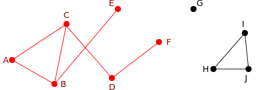

> La théorie des graphes est l'étude des structures mathématiques utilisées pour modéliser des relations par paires entre des objets. Dans ce contexte, un graphe est constitué de sommets qui sont reliés par des arêtes.
{ .definition }

Un graphe **G** est constitué de deux ensembles **V** et **E** où  
- V est un ensemble fini mais non vide de sommets ;
- E est un ensemble d’arêtes.

Une arête est un ensemble de deux sommets appartenant à V.

### Vocabulaire

Les **sommets** sont appelés aussi des **nœuds**. En anglais ils sont appelés _**nodes**_ _**points**_ ou _**vertices**_ (sing. _vertex_).

Les **arêtes** sont appelés aussi des **arcs**. En anglais ils sont appelés _**links**_, _**lines**_ ou _**edges**_.


```
V = [A, B, C, D, E, F, G, H, I, J]  
E = [{A, B}, {A, C}, {B, C}, {C, D}, {B, E}, {E, F}, {D, F}, {H, I}, {H, J}, {I, J}]
```

#### Notation : 

L’arête {A, B} pourra être notée  A—B ou B—A. 

### Définitions : 

Soit un graphe G = {V , E}.

- L'**ordre** (_order_) d'un graphe est le nombre de sommets |V| ;
- La **taille** (_size_) d'un graphe est le nombre d'arêtes |E| ;
- deux sommets A, B ∈ V (qui appartiennent à l'ensemble des sommets V) sont **adjacents** s’ils sont reliés par une arête. Par exemple si A—B ∈ E (l'arête A-B appartient à l'ensemble E des arêtes) ;
- une arête A—B est **incidente** aux sommets A et B ;
- le **degré** (_degree_ or _valency_) d’un sommet est le nombre d’arêtes qui lui sont incidentes.
- le **degré** d'un graphe est le maximum des degrés de ses sommets.

Dans notre exemple :
- A et B sont adjacents ;
- l’arête B—C est incidente à B et à C ;
- le degré de A est 2 ;
- le degré de B est 3 ;
- le degré de G est 0 ;
- le degré de E est 1 ;
- L'ordre du graphe est 10.

La somme des degrés de tous les sommets d'un graphe est égal au double du nombre total d'arêtes.

### Sous-graphes

Soit un graphe G = {V , E}. 

Le graphe G' {V', E'} est un **sous-graphe** de G si les conditions suivantes sont réunies :
- V' ⊆ V et V ≠ ∅ (V' est inclus dans V et non nul) ;
- E' ⊆ E ;
- les sommets composant les arêtes de E' doivent appartenir à V'.



### Multigraphes / multigraph

Une paire de sommets peut être connectée par plus d’une arête

<svg>
<g fill="red">
  <circle cx="280" cy="40" r="5"/>
  <text x="290" y="40">G</text>
  <circle cx="250" cy="100" r="5"/>
  <text x="260" y="110">F</text>
</g>
<g>
  <circle cx="30" cy="25" r="5"/>
  <text x="10" y="30">A</text>
  <circle cx="115" cy="20" r="5"/>
  <text x="125" y="25">B</text>
  <circle cx="70" cy="120" r="5"/>
  <text x="50" y="125">C</text>
  <circle cx="150" cy="80" r="5"/>
  <text x="160" y="85">D</text>
  <circle cx="170" cy="140" r="5"/>
  <text x="180" y="140">E</text>
  <circle cx="200" cy="50" r="5"/>
  <text x="195" y="40">H</text>
</g>
<g stroke="#f00" stroke-width="2" fill="none">
  <line x1="280" y1="40"  x2="250" y2="100"/>
  <path d=" M280 40Q 230 50, 250 100">
</g>
<g stroke="#000" stroke-width="2" fill="none">
  <line x1="30"  y1="25"  x2="115" y2="20"/>
  <line x1="115" y1="20"  x2="70"  y2="120"/>
  <line x1="70"  y1="120" x2="150" y2="80"/>
  <line x1="150" y1="80"  x2="170" y2="140"/>
  <line x1="30"  y1="25"  x2="150" y2="80"/>
</g>
</svg>


### Graphes orientés / directed graph

Un graphe est orienté si ses arêtes, appelées **arcs** dans ce cas, ont un sens de parcours.

- Une arête partant du sommet A et allant au sommet B est dénotée A → B.
- Le **degré intérieur** d’un sommet est le nombre d’arêtes arrivant à ce sommet.
- Le **degré extérieur** d’un sommet est le nombre d’arêtes sortant de ce sommet


Le degré intérieur de D est 1 ; son degré extérieur est 2.

### Graphes étiqueté

Un graphe est étiqueté si ses arêtes (ou ses arcs dans le cas d'un graphe orienté) sont affectés d'étiquettes (mots, lettres, symboles, nombres, …)

### Graphes pondérés

Dans le cas où les étiquettes sont des nombres, le graphe est dit pondéré. Les étiquettes sont appelées les **poids** entre les sommets.
Le poids d'une chaîne est la somme des poids des arêtes constituant la chaîne.
De manière identique dans un graphe orienté Le poids d'un chemin est la somme des poids des arcs constituant le chemin.

### Boucles : 

Une boucle c'est lorsqu'une arête a pour extrémités un seul et même sommet. L'incidence est compté double pour le sommet.

<svg>
<g fill="red">
  <circle cx="280" cy="40" r="5"/>
  <text x="290" y="40">G</text>
  <circle cx="250" cy="100" r="5"/>
  <text x="240" y="92">F</text>
</g>
<g>
  <circle cx="30" cy="25" r="5"/>
  <text x="10" y="30">A</text>
  <circle cx="115" cy="20" r="5"/>
  <text x="125" y="25">B</text>
  <circle cx="70" cy="120" r="5"/>
  <text x="50" y="125">C</text>
  <circle cx="150" cy="80" r="5"/>
  <text x="160" y="85">D</text>
  <circle cx="170" cy="140" r="5"/>
  <text x="180" y="140">E</text>
  <circle cx="200" cy="50" r="5"/>
  <text x="195" y="40">H</text>
</g>
<g stroke="#f00" stroke-width="2" fill="none">
  <line x1="280" y1="40"  x2="250" y2="100"/>
  <circle cx="245" cy="114" r="15"/>
</g>
<g stroke="#000" stroke-width="2" fill="none">
  <line x1="30"  y1="25"  x2="115" y2="20"/>
  <line x1="115" y1="20"  x2="70"  y2="120"/>
  <line x1="70"  y1="120" x2="150" y2="80"/>
  <line x1="150" y1="80"  x2="170" y2="140"/>
  <line x1="30"  y1="25"  x2="150" y2="80"/>
</g>
</svg>

### Vide

Un graphe vide contient que des sommets et aucun arête.

<svg>
<g>
  <circle cx="280" cy="40" r="5"/>
  <text x="290" y="40">G</text>
  <circle cx="250" cy="100" r="5"/>
  <text x="240" y="92">F</text>
  <circle cx="30" cy="25" r="5"/>
  <text x="10" y="30">A</text>
  <circle cx="115" cy="20" r="5"/>
  <text x="125" y="25">B</text>
  <circle cx="70" cy="120" r="5"/>
  <text x="50" y="125">C</text>
  <circle cx="150" cy="80" r="5"/>
  <text x="160" y="85">D</text>
  <circle cx="170" cy="140" r="5"/>
  <text x="180" y="140">E</text>
  <circle cx="200" cy="50" r="5"/>
  <text x="195" y="40">H</text>
</g>
</svg>

### Complet

Un graphe est dit complet quand tous les sommets sont adjacents de tous les autres.

<svg>
<g stroke="#ccc" stroke-width="1" fill="none">
  <line x1="115" y1="20"  x2="70"  y2="120"/>
  <line x1="115" y1="20"  x2="150"  y2="80"/>
  <line x1="115" y1="20"  x2="170"  y2="140"/>
  <line x1="115" y1="20"  x2="200"  y2="50"/>
  <line x1="115" y1="20"  x2="250"  y2="100"/>
  <line x1="115" y1="20"  x2="280"  y2="40"/>
</g>
<g stroke="#ccc" stroke-width="1" fill="none">
  <line x1="70" y1="120"  x2="150"  y2="80"/>
  <line x1="70" y1="120"  x2="170"  y2="140"/>
  <line x1="70" y1="120"  x2="200"  y2="50"/>
  <line x1="70" y1="120"  x2="250"  y2="100"/>
  <line x1="70" y1="120"  x2="280"  y2="40"/>
</g>
<g stroke="#ccc" stroke-width="1" fill="none">
  <line x1="170" y1="140"  x2="150"  y2="80"/>
  <line x1="170" y1="140"  x2="200"  y2="50"/>
  <line x1="170" y1="140"  x2="250"  y2="100"/>
  <line x1="170" y1="140"  x2="280"  y2="40"/>
</g>
<g stroke="#ccc" stroke-width="1" fill="none">
  <line x1="150" y1="80"  x2="200"  y2="50"/>
  <line x1="150" y1="80"  x2="250"  y2="100"/>
  <line x1="150" y1="80"  x2="280"  y2="40"/>
</g>
<g stroke="#ccc" stroke-width="1" fill="none">
  <line x1="200" y1="50"  x2="250"  y2="100"/>
  <line x1="200" y1="50"  x2="280"  y2="40"/>
</g>
<g stroke="#ccc" stroke-width="1" fill="none">
  <line x1="250" y1="100"  x2="280"  y2="40"/>
</g>
<g>
  <circle cx="280" cy="40" r="5"/>
  <text x="290" y="40">G</text>
  <circle cx="250" cy="100" r="5"/>
  <text x="240" y="92">F</text>
  <circle cx="30" cy="25" r="5"/>
  <text x="10" y="30">A</text>
  <circle cx="115" cy="20" r="5"/>
  <text x="125" y="25">B</text>
  <circle cx="70" cy="120" r="5"/>
  <text x="50" y="125">C</text>
  <circle cx="150" cy="80" r="5"/>
  <text x="160" y="85">D</text>
  <circle cx="170" cy="140" r="5"/>
  <text x="180" y="140">E</text>
  <circle cx="200" cy="50" r="5"/>
  <text x="195" y="40">H</text>
</g>
<g stroke="#000" stroke-width="1" fill="none">
  <line x1="30"  y1="25"  x2="70" y2="120"/>
  <line x1="30"  y1="25"  x2="115" y2="20"/>
  <line x1="30"  y1="25"  x2="150" y2="80"/>
  <line x1="30"  y1="25"  x2="170" y2="140"/>
  <line x1="30"  y1="25"  x2="200" y2="50"/>
  <line x1="30"  y1="25"  x2="250" y2="100"/>
  <line x1="30"  y1="25"  x2="280" y2="40"/>
</g>

</svg>


### Chaîne

Dans un graphe non orienté, une **chaîne** (en. _Walk_) est une suite finie non vide d'arête du graphe. Les sommets et les arêtes peuvent aparaître zéro, une ou plusieurs fois dans la chaîne.

<svg>
  <circle cx="25" cy="25" r="5"/>
  <circle cx="50" cy="100" r="5"/>
  <circle cx="140" cy="130" r="5"/>
  <circle cx="150" cy="80" r="5"/>
  <circle cx="200" cy="40" r="5"/>
  <circle cx="290" cy="140" r="5"/>
<g stroke="#000">
  <line x1="25"  y1="25" x2="150" y2="80" />
  <line x1="150"  y1="80" x2="140" y2="130" stroke-width="3" />
  <line x1="140"  y1="130" x2="290" y2="140" />
  <line x1="290"  y1="140" x2="150" y2="80" />
  <line x1="140"  y1="130" x2="50" y2="100" />
</g>
<svg>

A  C D F C D B

### Circuit

Un circuit est une séquence de nœuds adjacents commençant et se terminant au même nœud. Les circuits ne répètent jamais les arêtes. Cependant, ils autorisent les répétitions de sommets dans la séquence.

### Chemin

En termes pratiques, un chemin est une séquence de nœuds non répétés connectés par des arêtes présentes dans un graphe. Nous pouvons comprendre un chemin comme un graphe où le premier et le dernier nœuds ont un degré un, et les autres nœuds ont un degré deux.


La longueur d'une chaîne est celle de sa suite d'arêtes (un moins que la longueur sa suite de sommets). 
La notion correspondante dans un graphe orienté est celle d'un chemin. 

La **source** de la chaîne est son premier sommet, et son **but** est son dernier sommet. Une chaîne est dite élémentaire si aucun sommet ne figure plus d'une fois dans la suite, à l'exception de la source et le but de la chaîne qui peuvent coïncider.

Parcours|Répetition de sommets|Répetition d'arêtes|Fermé
---|---|---|---
Walk|Oui |	Oui 	|
Trail 	|Oui |	Non 	|Non
Circuit |	Oui |	Non 	|Oui
Chemin / Path |	Non |	Non |	Non
Cycle |	Non |	Non |	Oui

### Cycle

Un cycle consiste en une séquence de nœuds adjacents et distincts dans un graphe. La seule exception est que le premier et le dernier nœuds de la séquence de cycles doivent être le même nœud.

Un cycle est un chemin fermée.

### Chemins

Un chemin est un sous-graphe G = {V , E} où
- V = {v1 , v2 , ..., vn },
- E = {v1 — v 2 , v2 —v3 , ... , vn-1 — vn },
- n  1,
- les sommets v1 , v2 , . . . , vn sont tous distincts,
- les sommets v1 et vn sont appelés les **extrémités** du chemin.

La longueur d’un chemin contenant n sommets est n - 1

<svg>
<g fill="#f00">
<circle cx="30" cy="70" r="5"/>
<text x="25" y="60">A</text>
<circle cx="150" cy="90" r="5"/>
<text x="160" y="100">D</text>
<circle cx="200" cy="60" r="5"/>
<text x="195" y="50">H</text>
<circle cx="280" cy="40" r="5"/>
<text x="290" y="40">G</text>
<circle cx="250" cy="100" r="5"/>
<text x="260" y="110">F</text>
</g>
<circle cx="115" cy="15" r="5"/>
<text x="125" y="15">B</text>
<circle cx="50" cy="120" r="5"/>
<text x="30" y="125">C</text>
<circle cx="170" cy="140" r="5"/>
<text x="180" y="140">E</text>
<g stroke="#f00" stroke-width="2">
<line x1="150" y1="90" x2="200"  y2="60"/>
<line x1="200" y1="60" x2="250"  y2="100" />
<line x1="30" y1="70" x2="150"  y2="90" />
<line x1="280" y1="40" x2="250"  y2="100" />
</g>
<g stroke="#000" stroke-width="2">
<line x1="150" y1="90" x2="170"  y2="140" />
<line x1="50" y1="120" x2="115"  y2="15" />
<line x1="30" y1="70" x2="115"  y2="15" />
<line x1="50" y1="120" x2="150"  y2="90" />
</g>
</svg>

### Graphes connexes

Un graphe G = {V , E} est connexe si pour **toute paire** de sommets A, B ∈ V, il existe un chemin à extrémités A et B dans G 
