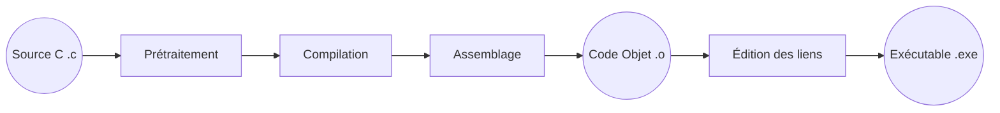

**Prétraitement** : Le traitement par le préprocesseur : le fichier source est analysé par le préprocesseur qui effectue des transformations textuelles dans le fichier source. Substitution de chaine de caractère, des constantes, prise en compte des directives de compilation, inclusion des autres fichiers sources...

```c
#define PI 3.1415

double aire = PI * pow(rayon, 2);
```

remplacé par

```c
double aire = 3.1415 * pow(rayon, 2);
```

**La compilation** : C’est la traduction du fichier généré par le préprocesseur en assembleur, c’est-à-dire en une suite d’instruction correspondant au microprocesseur cible. (en mnémonique rendant la lecture encore possible).

**L’assemblage** : L'assembleur traduit le code assembleur en code objet binaire directement compréhensible par le processeur. (fichiers objets).

**L’édition de liens** : Le linker combine le code objet avec les bibliothèques nécessaires (comme la bibliothèque standard C) pour produire un exécutable. (fichiers exe ou out).



<script type="module">
  import mermaid from 'https://cdn.jsdelivr.net/npm/mermaid@11/dist/mermaid.esm.min.mjs';
  mermaid.initialize({ startOnLoad: true });
  await mermaid.run({
  querySelector: '.language-mermaid',
});
</script>
