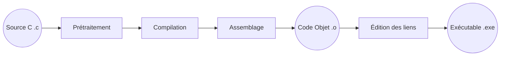

[SQLite dans un programme C](sqlite)

[Télémétrie](telemetry)
- [Journaux](log) 
- 

- [Installation de Grafana](grafana) 
- [Installation de Loki](log/loki)
- [Installation de Prometheus](prometheus)
- Implémenter [libprom](libprom)
- [Communication réseau](net)

