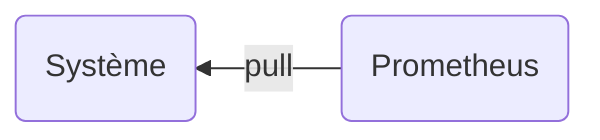
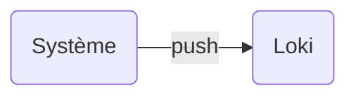
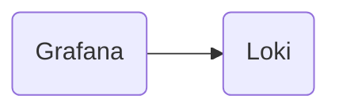

La différence entre les approches Push et Pull réside dans la manière dont les données sont transmises d'une source (comme une application ou un service) vers un système de surveillance ou de traitement des données. 

## Pull

> Le système collecteur **interroge** activement les sources de données pour récupérer des informations.
{: .definition }

Exemple : Prometheus envoie une requête HTTP périodique à une application pour obtenir ses métriques.

### Caractéristiques :

- Initiative côté collecteur : Le collecteur décide quand et comment récupérer les données.
- Simplicité de la gestion des sources :
  - Chaque source expose un endpoint fixe (généralement HTTP).
  - Le collecteur "scrape" (récupère) ces endpoints.
- Découverte automatique des services : Idéal pour les environnements dynamiques où les services et instances changent fréquemment.
- Pas besoin de configuration complexe sur les sources : Elles doivent uniquement exposer les métriques.

### Avantages :

- Fiabilité accrue : Si une source ne répond pas, cela n'affecte pas les autres.
- Visibilité et contrôle centralisé.
- Facile à configurer dans des environnements dynamiques.

### Inconvénients :

- Le système collecteur doit connaître l'emplacement des sources.
- Peut être difficile dans les environnements où les services sont **protégés par des pare-feux** ou où l'**accès réseau est limité**.

## Push

> Les sources de données **envoient** activement leurs informations au collecteur.
{: .definition }

Exemple : Une application pousse des métriques ou logs vers un système centralisé.

### Caractéristiques :

- Initiative côté source : Les sources décident quand envoyer les données.
- Flexibilité des données : Les sources peuvent choisir le moment, la fréquence et le contenu des données envoyées.
- Nécessité de configurer chaque source : Les sources doivent être configurées pour savoir où envoyer leurs données.

### Avantages :

- Utile dans des environnements où les collecteurs ne peuvent pas interroger directement les sources (pare-feux stricts, NAT).
- Prise en charge des environnements où les sources ne sont pas statiques ou sont très nombreuses.
- Permet un buffer côté source (via des agents) pour éviter les pertes de données en cas de panne du collecteur.

### Inconvénients :

- Plus de charge de configuration côté source.
- Peut entraîner des problèmes de surcharge côté collecteur si toutes les sources poussent simultanément.
- Moins de visibilité sur l'état des sources (elles peuvent être silencieuses sans qu'on s'en rende compte)

## Collecteurs

> Le rôle d'un collecteur est de collecter, transformer, et transmettre des données vers des destinations ou systèmes de stockage et d'analyse.
{. definition }

### 1. Collecte des données

Un collecteur agit comme une passerelle pour agréger des données provenant de multiples sources :

- Logs : Journaux d'applications, d'accès, ou systèmes.
- Métriques : Données numériques sur les performances (CPU, mémoire, etc.).
- Traces : Informations de suivi des transactions distribuées.

### 2. Transformation des données
 
Les collecteurs offrent des capacités pour filtrer, enrichir ou formater les données avant de les transmettre.

- Filtrage : Retirer les données inutiles.
- Enrichissement : Ajouter des informations supplémentaires comme des labels ou des métadonnées (exemple : nom d'hôte, région).
- Conversion : Transformer les données brutes en un format compatible avec les systèmes cibles.

### 3. Bufferisation et fiabilité

Les collecteurs gèrent les interruptions réseau ou les problèmes côté destination grâce à des buffers.

Pourquoi c'est important ?
- Pour éviter la perte de données si la destination est temporairement inaccessible.
- Pour réguler le débit d'envoi en cas de surcharge.

Méthodes courantes :
- Stockage en mémoire.
- Sauvegarde sur disque en cas de panne prolongée.

### 4. Envoi des données vers des destinations

Les collecteurs acheminent les données vers un ou plusieurs systèmes de destination, appelés souvent des backends ou sinks.
