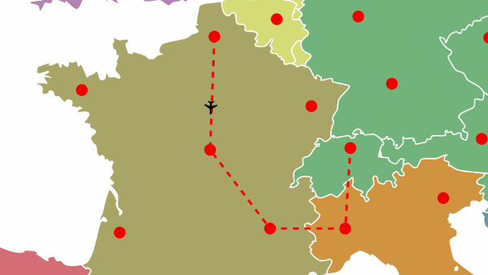

On vous demande de simuler la trajectoire d'un avion sur une carte.

Concevoir une page html et insérer la carte de l'<a href="europe.svg" download>Europe</a>.

L'opérateur ne veut pas voir toute la carte mais afficher uniquement une zone de 445px/380px à partir du point 155px/215px

Ajouter un symbole <a href="avion.svg" download>avion</a> dans le fichier SVG.

Placer le symbole de l'avion à l'origine de l'illustration. Sa taille dans l'illustration est de 10px/10px. Faire une rotation et une translation pour aligner le nez de l'avion avec l'axe des x (abscises).

Ajouter un chemin sur la carte, le chemin aura une épaisseur de 2px et sera en pointillé de 5px.

Attacher un événement sur le clic des cercles. Lors du clic sur le premier cercle définir le départ du chemin. Lors des clics suivants ajouter un segment de droite au chemin.

Ajouter une animation de parcours sur le symbole de l'avion. Prendre comme référence de chemin la trajectoire dessinée précédemment. Effectuer une rotation automatique du symbole le long de la trajectoire. Ne pas redémarrer l'animation tant qu'elle est en cours.

Calculer la distance entre 2 clics successifs sur les cercles. Calculer la distance euclidienne entre ces points. Calculer la durée de l'animation pour que la vitesse soit constante et de 20 px/seconde. 

