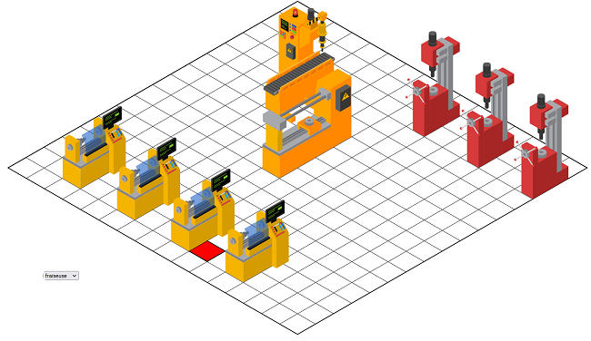

La société [Ewattch](https://ewattch.com/logiciels/#easyvision) de Saint Dié implémente des solutions iot de suivi de consommation électrique de machine industrielles.

Un des module consiste à modéliser un atelier en 3D isométrique.

Reproduire ce module



Vous disposez des illustrations svg des machines.

#|machine|largeur|hauteur|échelle|origine x|origine y
--:|---|--:|--:|--:|--:|--:|
1|<a href="demo/machine-1.svg" download>inspection</a>|66.860|69.700|1.7|14.20|69.700
2|<a href="demo/machine-2.svg" download>cn</a>|63.140|82.689|1.2|17.79|82.689
3|<a href="demo/machine-3.svg" download>perceuse</a>|40.580|79.180|1.6|13.99|79.180
4|<a href="demo/machine-4.svg" download>tour</a>|89.020|94.630|1.2|17.78|94.630
5|<a href="demo/machine-5.svg" download>foreuse</a>|63.250|97.190|1.35|14.25|97.190
6|<a href="demo/machine-6.svg" download>robot</a>|78.780|85.510|1.6|29.76|85.510
7|<a href="demo/machine-7.svg" download>fraiseuse</a>|80.130|98.880|1.33|15.44|98.880


### Optimiser les fichiers SVG

Installer le composant nodejs [svgo](https://github.com/svg/svgo). 
Optimiser les illustrations des machines.

Attention : Il faudra peut être ajouter à la variable d'environnement PATH le dossier d'installation de svgo qui se trouve par défaut dans  `C:\Users\VotreCompte\AppData\Roaming\npm`

### Dessiner la gille

Dessiner un carré de 400px de côté, remplir avec un motif `pattern` de dessiner une grille avec un pas de 25px.

Appliquer une transformation isométrique à la grille.

### Choix de la machine

Ajouter un champ de sélection select pour choisir la machine 

Lorsque l'on clique sur la grille la machine sélectionnée est téléchargée, ajouter à l'illustration svg et positionnée sur la grille

Attention le téléchargement d'éléments extérieurs à la page html ne peut s'effectuer que si la page est hébergée sur un serveur web.

Installer le serveur web de développement Live Server dans Visual Studio. Cliquer sur le menu `Go Live` à gauche de la barre de statut de VS Code pour démarrer le serveur.

### Fonctions Javascript

Pour vous aider dans le développement, voici quelques fonctions javascript utiles.


Transformer des coordonnées du plan de l'écrans en coordonnées isométriques. La valeur 360 correspond à un déplacement arbitraire pour centrer la grille dans l'écran.

```javascript
function planToIsometric(x , y) {
  x = x - 360 / zoom;
  y = y;

  let X = x * Math.cos(angle) - y * Math.sin(angle); 
  let Y = x * Math.sin(angle) + y * Math.cos(angle);

  x = X + Y * Math.tan(Math.PI / 6); 
  y = Y / Math.cos(angle);

  return { x, y };
}
```

Transformer des coordonnées isométriques en coordonnées du plan

```javascript
function isometricToPlan(h , v) {  
  let Y = v * 0.86603;
  let X = h - Y * Math.tan(Math.PI / 6);

  let x = (X + Y * Math.tan(angle)) * Math.cos(angle); 
  let y = (Y - x * Math.sin(angle)) / Math.cos(angle);

  x = x + 360;

  return { x, y };
}
```


Convertir du texte (récupéré avec une fonction fetch) en objet xml et extraire l'élément SVG.

```javascript
const xml = new window.DOMParser().parseFromString(str, "image/svg+xml");
const svg = xml.children[0];
```

Fixer les attributs width et height en fonction des machines et ajuster au facteur d'échelle.

Décaler l'origine de la machine en fonction de la machine
