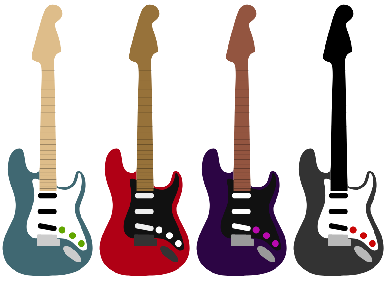

Dans un page html ajouter l'illustration de la [guitare](guitare.svg) dans une définition de symbole

Ajouter une illustration SVG de 800px de large et 800px de haut

Dupliquer le symbole de la guitare plusieurs fois

Colorier à l'aide de variables css les éléments de la guitare

palette|neck|body|guard|knobs|pickups|bridge|jack
---|---|---|---|---|---|---|---
1|#debd8a|#406872|#ffffff|#62a600|#000|#ccc|#ccc
2|#97723a|#b00015|#111111|#ffffff|#eee|#333|#333
3|#935540|#2c0544|#111111|#b909ae|#fff|#999|#999
4|#000|#333|#ffffff|#ca0606|#000|#b9b9b9|#b9b9b9

Définir dans chaque classe les valeurs des variables

```css
.theme1 {
  --primary-color: red;
}

.theme2 {
  --primary-color: yellow;
}
```

Utilisez la variable pour définir le remplissage des différentes parties.

```svg
<path fill="var(--primary-color)">
```



Références
- https://tympanus.net/codrops/2015/07/16/styling-svg-use-content-css/
- https://frontstuff.io/multi-colored-svg-symbol-icons-with-css-variables