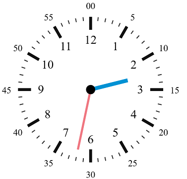

Vous devez réaliser un outil d'apprentissage de l'heure

{ width: 500px; }

## Dessiner une horloge

Dans un canvas de 220px de largeur et 240px de hauteur

Définir un trait de longueur 17px et 3.8px d'épaisseur pour les heures.

Définir un trait de longueur 5px et un de 1.2px pour les minutes

Définir un groupe représentant 5 minutes composé d'un trait d'heure et de 4 traits de minutes.

Répéter ce bloc autant de fois que nécessaire pour faire un cercle complet

Ajouter 2 aiguilles une pour les heures et une pour les minutes. 

*Facultatif* : 

Marquer les heures et les minutes avec du texte

## Ajouter 2 slider

Un pour les heures de 0 à 12 et l'autre pour les minutes

Lorsque l'on bouge les sliders faire bouger les aiguilles.
