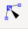
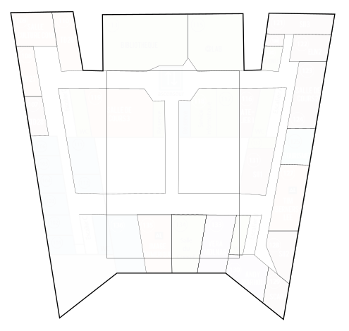
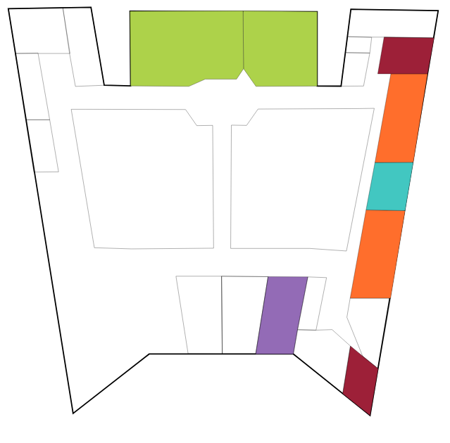

> **Inkscape** est un logiciel de dessin vectoriel libre multiplateforme. Il gère des fichiers conformes aux standards XML, SVG et CSS du W3C.

Il offre des fonctionnalités similaires aux logiciels propriétaires comme CorelDRAW et Adobe Illustrator. Un peu plus austère, il demande un peu plus de maîtrise. 

A savoir : Le logiciel est intégré à la liste des logiciels libres préconisés par l’État français dans le cadre de la modernisation globale de ses systèmes d’informations.

Copier L'archive `inkscape-1.1-x64.7z` depuis le disque pédagogique `\info\amio\intégration et documents web`\
Décompresser le dans `c:\temp`

Ajouter l'image le <a href="plan.png" download>plan</a> de l'IUT au format png\
File - Import

Les touches + et - du pavé numérique permettent de zoomer.\
Cliquer sur la molette de la souris pour vous déplacez dans l'illustration

Ajouter un nouveau calque.
Menu Layer - Layers ...

Vérrouiller le layer 1 pour ne pas dessiner dessus par inadvertance.\
Régler l'opacité du layer 1 à 60% (Opacity en dessous de la liste)

Retourner sur le layer 2

Prendre l'outil courbe de Bézier (touche B) et dessiner le contour du bâtiment.\
Fermer bien la forme en sélectionnant le premier point lorsque vous avez fini.

Régler l'épaisser du trait sur 3px\
Menu Objet - Fill and Stroke - Stroke Style

Dessiner les salles intérieures avec une épaisseur de trait de 1.5px\
Utiliser le clic sur la molette et les touches + et - du pavé numérique pour vous déplacer dans l'illustration.

Pour modifier la position d'un point particulier d'un chemin il faut utiliser l'outil de sélection des nodes. 

Renseigner les identifiants sur les salles.\
Menu Object - Object Properties

### Dimensions de la zone de travail

Pour terminer modifier la zone de travail pour englober parfaitement le plan.
Menu File - Document Properties
Déployer le menu Resize page to content et cliquer sur le bouton Resize page to drawing or selection

Pour optimiser le code source : sortir les chemins du layer 2

Enregistrer le fichier au format SVG

## Intégration html / css

Copier/coller le code source du fichier SVG dans une page html.
Supprimer les éléments d'en-tête Inkscape inutiles.\
Supprimer le prologue xml
Supprimer le code relatif au layer 1 avec l'image.

Ajouter une feuille de style à la page html

Ajouter des classes css sur les salles
info pour les salles du département info\
geii pour les salle du département génié électrique\
mmi pour les salle du département mmi

Retirer le style en ligne `fill:none` des chemins sinon celui-ci prendra le dessus.

Définir la couleur de remplissage dans les classes CSS
#ff6e2c pour info\
#9d2038 pour geii\
#936bb6 pour mmi\
#add24a pour les salles des 3 départements
#42c7c1 pour la lp tourisme

