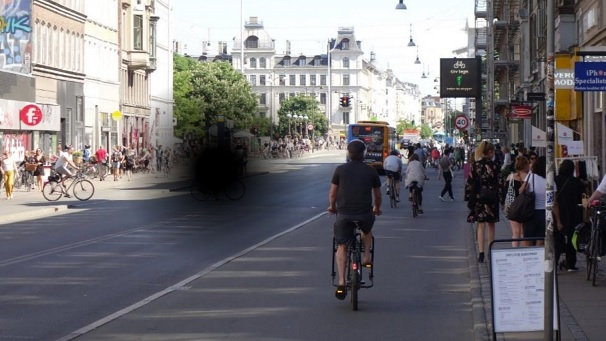
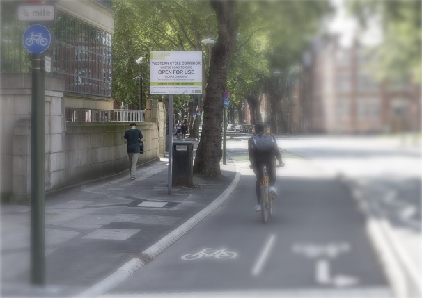

> ***Prérequis :*** le format SVG, les [filtres](../)
:{.info}

## Exercice 1

On désire mettre en place un simulateur de déficience visuelle lié à la DMLA (dégénérescence maculaire liée à l'âge). Cette maladie se traduit par une tache noir au centre de la vision

<a href="street1.jpg" download>photo 1</a>

Créer une page html. Ajouter une illustration SVG couvrant 100% de la page.

Ajouter la photo et couvrir d'un rectangle noir par dessus.

Définir un gradient radial de rayon couvrant 40% de la zone avec un centre totalement blanc jusqu'à 20% du rayon du cercle puis ensuite un dégradé vers le noir à 100% du rayon.

Créer un masque pour sélectionner un cercle (rayon 20% du total) dans le rectangle noir. Utiliser le dégradé radial, sachant que le blanc laisse la forme intacte et la couleur noire supprime la supprime

Ajouter un bloc javascript dans la page, écouter le déplacement de la souris sur le document et modifier les coordonnées du cercle en fonction de la souris

[Réponse](reponse1)

## Exercice 2

Sur le même principe que l'exercice précédent Mettre en place un simulateur de glaucome. Le glaucome se traduit par une baisse du contraste des couleurs et par une vision floue périphérique

<a href="street2.jpg" download>photo 2</a>

Créer une page html. Ajouter une illustration SVG couvrant 100% de la page.

Définir un filtre complexe composé

d'un premier filtre flou gaussien (feGaussianBlur) de déviation 8. identifier le resultat
Le resultat de ce filtre sert d'entrée pour un deuxième filtre de réduction de contraste qui utilise un matrice de conversion de couleur (feColorMatrix)

|r|v|b|a
--:|--:|--:|--:|
0.8|0.1 |0.1| 0| 0
0.1| 0.8| 0.1| 0| 0
0.1| 0.1| 0.8| 0| 0
0 | 0| 0| 0.8 | 0

https://runebook.dev/fr/docs/svg/element/fecolormatrix

Créer maintenant un masque basé sur un dégradé radial de taille 50% et basé sur 40% de la photo
Le centre (0%) affiche l'image, La périphérie (100%) l'efface

Ajouter 2 fois la photo.
- Le première prend le filtre flou
- La deuxième le masque basé sur le dégradé radial

Suivant lla veleur du masque c'est soit la photo floue qui sera visible soit la photo nette.

Ajouter un bloc javasript dans la page, écouter le déplacement de la souris sur le document et modifier les coordonnées du cercle en fonctionde la souris

[Réponse](reponse2)