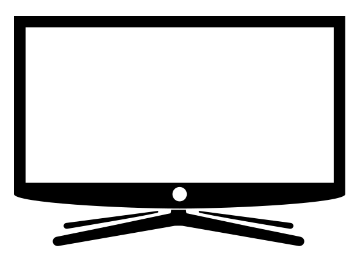
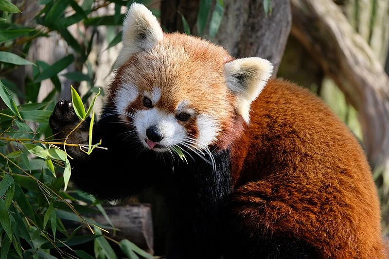

> ***Pérequis :*** le format SVG, les [formes](../), les [propriétés](../../propriétés), le [masquage](../../découpe)
{.info}

Vous devez dessiner un téléphone au format SVG.
Utilisez Visual Studio Code avec l'extension SVG de Jock pour prévisualiser le résualt.

Une partie de l'illustration est déja fournie

```svg
<g id="pied">
  <path d="M99.401,76.806l-18.189-3.69 -21.333-4.483c-0.099-0.368-0.166-0.778-0.197-1.22c-0.854,0.003-1.71,0.006-2.57,0.006
    s-1.716-0.003-2.573-0.006c-0.028,0.442-0.099,0.852-0.197,1.221l-21.236,4.462 -18.284,3.709c-0.93,0.179-1.533,1.039-1.343,1.92
    c0.188,0.883,1.096,1.452,2.028,1.272l40.321-7.015c0.432-0.013,0.88-0.02,1.342-0.02c0.414,0,0.814,0.007,1.203,0.017
    l40.343,7.019c0.93,0.179,1.838-0.391,2.027-1.272C100.934,77.845,100.333,76.986,99.401,76.806z"/>
  <path d="M18.519,74.021c0,0,31.385-5.191,31.475-5.683c0.208-0.084,0.075-0.533-0.118-0.519l-31.787,4.184
    c-0.588,0.113-0.969,0.656-0.85,1.214C17.357,73.773,17.932,74.133,18.519,74.021z"/>
  <path d="M96.986,73.216c0.12-0.558-0.26-1.101-0.85-1.214l-31.787-4.184c-0.193-0.014-0.326,0.435-0.118,0.519
    c0.088,0.492,31.475,5.683,31.475,5.683C96.292,74.133,96.867,73.773,96.986,73.216z"/>
</g>
```

L'illustration commence à l'origine en **0,0**.\
La largeur totale est de **115px** et la hauteur d'un côté de **62px**.\
La partie centrale est incurvée avec un vecteur de contrôle vertical qui descend de **3px** à bartir du bord, elle relie le point central qui est plus bas de **5px** que le bord, le vecteur issu du point central est horizontal est fait **20px**.\
Une courbe relie l'autre bord de l'écran, elle est symétrique par rapport à la première.

La marge entre le bord extérieur et la La zone vide intérieure fait **4px**.

Vous devez dessiner l'écran avec un seul élément path qui sera composé de 2 parties. Pour passer d'une partie à l'autre il faut fermer le premier chemin avec la commande z et se déplacer au début du deuxième avec la commande M.
Pour que le centre soit vide il faut que les 2 chemins tournent en sens inverse l'un de l'autre.

Ajouter la photo du panda, fixer la hauteur de la photoraphie à **90px**, la largeur est laissée en automatique par rapport à la hauteur.

Faire un découpage de l'image pour la faire rentrer dans la tv





