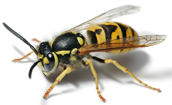
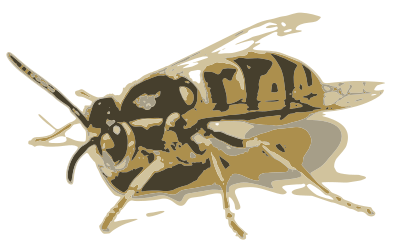
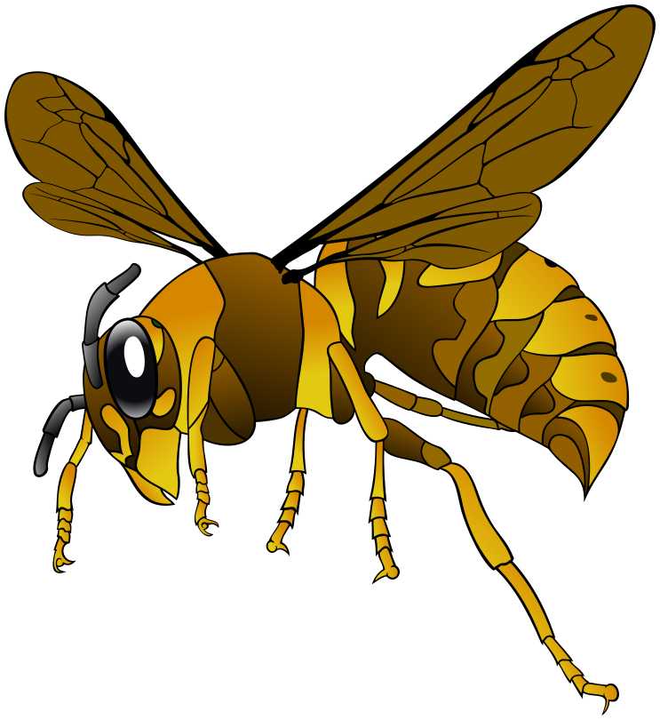
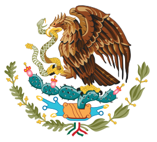
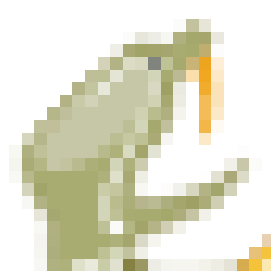

> ***Objectif :*** Concevoir des éléments graphiques redimensionnables sans perte de qualité. Interagir avec les propriétés graphiques. Animer les éléments.
{: .objectif}

## Image matricielle / vectorielle

L'**image matricielle** ou bitmap est le type d'image la plus utilisée. Elle est constituée d'une grille (matrice) de millions de points de couleur. Chaque point, élément de l'image est appelé pixel (picture element). Il est défini par sa propre couleur indépendamment des autres pixels qui l'entoure. L'image matricielle est utilisée de préférence en photographie car elle rend parfaitement les millers de nuance de couleur.

Avantages :
- réalisme des images (couleurs, ombres, nuances, dégradés, flous)
- fidelité par rapport à la scène originale
- palette de couleur très étendue
- format par défaut des appareils photos et scanners

Inconvénients :
- Perte de qualité lors du redimensionnement
- Approximation au pixel près des éléments géométriques
- Poids du fichier constitué de millions d'éléménts (pixels).

L'**image vectorielle**, quand à elle, est utilisé dans les dessins ou les illustrations. L'image est constituée de courbes, de lignes et de formes géométriques. Le rendu de l'illustration est calculé à chaque affichage par le navigateur.

Avantages :
- Redimensionnement infini
- Précision des éléments géométriques
- Poids du fichier réduit même pour de grandes surface d'affichage (pour une illustration simple)
- Modification des éléments de l'illustration par programmation (changement de couleur, animation)
- Sous sélection de parties de l'illustration

Inconvénients :
- Difficulté décrire des scènes complexes, réelles
- Poids du fichier croissant avant le détail de l'image
- Calcul de rendu à chaque affichage

<div style="display:flex; justify-content: space-between;">
<figure>
  
  <figcaption>image matricielle jpg<br>photo réaliste<br>11 ko</figcaption>
</figure>
<figure>
  
  <figcaption>image vectorielle<br>illustration<br>212 ko</figcaption>
</figure>
</div>

<div style="display:flex; justify-content: space-between;">
<figure>
  
  <figcaption>image vectorielle<br>illustration<br>79 ko</figcaption>
</figure>
<figure>
  
  <figcaption>image vectorielle<br>illustration<br>5 ko</figcaption>
</figure>
</div>

### Mise à l'échelle

<div style="display:flex; justify-content: space-between;">
<figure>
  
  <figcaption>image matricielle<br>png 66ko</figcaption>
</figure>
<figure>
  
  <figcaption>image vectorielle<br>158ko</figcaption>
</figure>
</div>

<div style="display:flex; justify-content: space-between;">
<figure>
  
  <figcaption>image matricielle x 14</figcaption>
</figure>
<figure>
  
  <figcaption>image vectorielle x 14</figcaption>
</figure>
</div>

## Programmation procédurale / descriptive

La **programmation procédurale** est une séquence d'appels à des fonctions permettant d'obtenir le résultat attendu.

L'interface de programmation Canvas (API) ajouté à l'HTML5 permet de dessiner via un programme JavaScript. Le développeur définit précisément, dans le code du programme, chacune des étapes à exécuter par le navigateur pour aboutir au résultat.

> Programation **procédurale** ou impérative = **Comment**
{:.definition}

```javascript
var ctx = document.getElementById("dessin").getContext("2d");

ctx.fillStyle = '#0039a6';
ctx.fillRect(0, 0, 50, 100);

ctx.fillStyle = '#d72b1f';
ctx.fillRect(0, 50, 150, 50);

ctx.fillStyle = '#fff';
ctx.beginPath();
ctx.moveTo(36.8882, 21.1373);
ctx.lineTo(17.6527, 35.1127);
ctx.lineTo(25.0000, 12.5000);
ctx.lineTo(32.3473, 35.1127);
ctx.lineTo(13.1118, 21.1373);
ctx.fill();
```
<canvas id="dessin"></canvas>
<script>
var ctx = document.getElementById("dessin").getContext("2d");
ctx.fillStyle = '#0039a6';
ctx.fillRect(0, 0, 50, 100);
ctx.fillStyle = '#d72b1f';
ctx.fillRect(0, 50, 150, 50);
ctx.fillStyle = '#fff';
ctx.beginPath();
ctx.moveTo(36.8882000, 21.1373000);
ctx.lineTo(17.6527000, 35.1127000);
ctx.lineTo(25.0000000, 12.5000000);
ctx.lineTo(32.3473000, 35.1127000);
ctx.lineTo(13.1118000, 21.1373000);
ctx.fill();
</script>

La **programmation descriptive** décrit à l'aide de mots clés (balises, attribut, propriétés) le résultat final souhaité. Plutôt que d’énoncer les différentes étapes à mettre en œuvre, un moteur d'interprétation se charge d'appeler automatiquement les fonctions nécessaires à la composition de l'image.
La programmation déclarative se concentre directement sur l’objectif à atteindre.

> Programation **déclarative** ou descriptive = **Quoi**
{:.definition}

```svg
<svg xmlns="http://www.w3.org/2000/svg" width="150" height="100" viewbox="0 0 1500 1000">
<rect width="1500" height="1000" fill="#fff"/>
<rect width="500" height="1000"  fill="#0039a6"/>
<rect x="0" y="500" width="1500" height="500" fill="#d72b1f"/>
<path d="M368.882 211.373L176.527 351.127 250 125l73.473 226.127-192.355-139.754" fill="#fff"/>
</svg>
```

<svg xmlns="http://www.w3.org/2000/svg" width="150" height="100" viewbox="0 0 1500 1000">
<rect width="1500" height="1000" fill="#fff"/>
<rect width="500" height="1000"  fill="#0039a6"/>
<rect x="0" y="500" width="1500" height="500" fill="#d72b1f"/>
<path d="M368.882 211.373L176.527 351.127 250 125l73.473 226.127-192.355-139.754" fill="#fff"/>
</svg>

## SVG : Scalable Vector Graphics

Les fichiers svg Scalable Vector Graphics (en français « graphique vectoriel adaptable ») sont des fichiers texte formaté en xml. Ils sont valides et bien formés. Nous pouvons utiliser un éditeur de texte pour créer des illustrations.


1- Installer l'extension SVG de *jock* pour Visual Studio Code.

2- Créer un document SVG (xml). Puis cliquer sur l'icône de prévisualition en haut à droite.

```svg
<?xml version="1.0" encoding="utf-8"?>
<svg xmlns="http://www.w3.org/2000/svg">
</svg>
```

3- Tracer un cercle de rayon 30 pixels dont le centre est situé à x = 150px et y = 75px. Remplir ce cercle avec la couleur orange

```svg
<circle cx="150" cy="75" r="30" fill="orange" />
```

Notez que comme pour tout document **xml valide**, les balises doivent être fermées ou auto fermées par une barre finale `/>`

4- Ajouter une ligne depuis dont les extrémités 1 et 2 sont situées aux coordonnées 150/45 et 150/20. Cette ligne a une épaisseur de 6 px, elle est de couleur orange et les extrémités sont arrondies.

```svg
<line x1="150" y1="45" x2="150" y2="20"
  stroke-width="6" stroke="orange" stroke-linecap="round" />
```

5- Dupliquer cetee ligne et appliquer une transformation pour effecuer une rotation de 45° en prenant comme centre de rotation, le centre du cercle (150/75)

```svg
<line x1="150" y1="45" x2="150" y2="20"
  stroke-width="6" stroke="orange" stroke-linecap="round"
  transform="rotate(45 150 75)" />
```
6- Recommencez l'opération et ajouter des lignes tout les 45° autour du cercle

7- Créer un groupe d'éléments `g` et placez y toutes les lignes

```svg
<g>
...
</g>
```


8- Ajouter une animation de transformation à l'intérieur du groupe. La transformation éffecue une rotation de 360° en 8 secondes de manière linéaire. La rotation a pour origine le centre du cercle (150/75).

```css
<animateTransform attributeName="transform"
  attributeType="XML"
  type="rotate"
  from="0 150 75"
  to="360 150 75"
  dur="8s"
  repeatCount="indefinite"/>
```


<svg xmlns="http://www.w3.org/2000/svg">
  <circle cx="150" cy="75" r="20" fill="orange" />
  <g>
    <line stroke="orange" x1="150"  y1="45" x2="150" y2="20"
      stroke-linecap="round" stroke-width="6" />
    <line stroke="orange" x1="150"  y1="45" x2="150" y2="20"
      stroke-linecap="round" stroke-width="6"
      transform="rotate(90 150 75)" />
    <line stroke="orange" x1="150"  y1="45" x2="150" y2="20"
      stroke-linecap="round" stroke-width="6"
      transform="rotate(45 150 75)" />
    <line stroke="orange" x1="150"  y1="45" x2="150" y2="20"
      stroke-linecap="round" stroke-width="6"
      transform="rotate(135 150 75)" />
    <line stroke="orange" x1="150"  y1="45" x2="150" y2="20"
      stroke-linecap="round" stroke-width="6"
    transform="rotate(180 150 75)" />
    <line stroke="orange" x1="150"  y1="45" x2="150" y2="20"
      stroke-linecap="round" stroke-width="6"
      transform="rotate(225 150 75)" />
    <line stroke="orange" x1="150"  y1="45" x2="150" y2="20"
      stroke-linecap="round" stroke-width="6"
      transform="rotate(270 150 75)" />
    <line stroke="orange" x1="150"  y1="45" x2="150" y2="20"
      stroke-linecap="round" stroke-width="6"
      transform="rotate(315 150 75)" />
    <animateTransform attributeName="transform"
        attributeType="XML"
        type="rotate"
        from="0 150 75"
        to="360 150 75"
        dur="8s"
        repeatCount="indefinite"/>
  </g>
</svg>

Et voilà votre première animation SVG.
Maintenant regardons plus en détail les [éléments](formes) SVG
